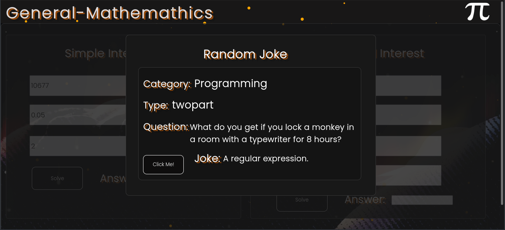

#  Genmath Interest Solver
> This is a website that solves Simple Interest && Compound Interest. This project is helpful especially when your lazy or
> when you dont know how to solve for both.
> 

##  Installation
```py
┌─[✗]─[user@parrot]─[~]
└──╼ $sudo git clone https://github.com/FonderElite/Genmath-Interest-Solver/
```

##   Demo


##  Technologies
 | **Languages** |   	   |
  :--- | :---

##   Fun-Feature 


### Api Used:  <a href="https://v2.jokeapi.dev/joke/Any">https://v2.jokeapi.dev/joke/Any</a>
